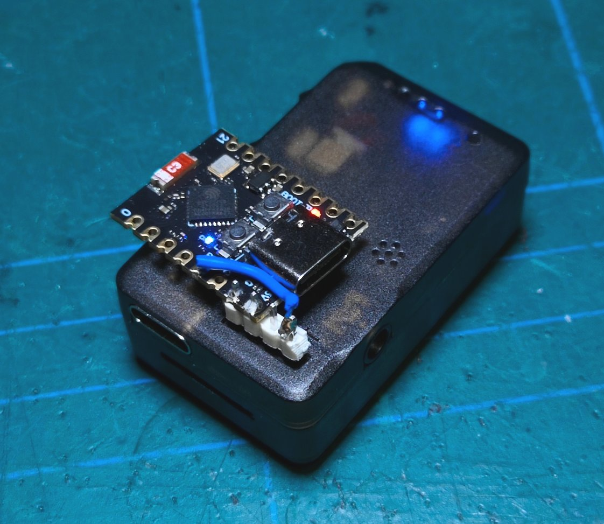

# AllXF Headtracker / PPM to ELRS Backpack bridge

An ESP32 Arduino sketch that reads the UART output of an AllXF Headtracker and sends the pan/tilt/roll angles to an ELRS Backpack (integrated in all modern ELRS TX modules) via ESP-NOW.  
Alternatively also supports capturing and sending any PPM signal the same way, tested up to 16 channels. 

This provides a local low power link between headtracker and radio instead of having to install a whole second long range RF system directly to the gimbal, and preserves the ability to mix the HT channels in the radio without extra hardware. The board is powered by the headtracker directly, so nothing extra to install/charge/maintain.

## Requirements

- **Hardware:** Any ESP32-family board (ESP32, S2, S3, C3, C6) and an ELRS TX module with backpack running at least ELRS 4.0.
- **Software:** Arduino IDE with the ESP32 board package installed, [ESP32_ppm](https://github.com/fanfanlatulipe26/ESP32_ppm) library.

## Setup

### 1. Install the ESP32 Board Package and dependencies

- In Arduino IDE, go to **File > Preferences** and add the ESP32 board manager URL, then install the **esp32** package via the **Boards Manager** in the left menu.
- Open the **Library manager** in the left menu, search and install **ESP32_ppm**.

### 2. Configure the Sketch

Open `elrsht.ino` and edit the options at the top:

#### Common settings:
```cpp
#define BINDING_PHRASE   "MY_PHRASE"  
#define LED              8
```

- **`BINDING_PHRASE`** must exactly match the binding phrase configured in your ELRS/Backpack setup.
- **`LED`** is the pin your board's LED is connected to.

#### AllXF settings
```cpp
#define RX_PIN           4 
```
- **`RX_PIN`** is the pin connected to the headtracker's UART "T" pin.

#### PPM Settings
```cpp
#define PPM_PIN          3
```
- **`PPM_PIN`** is the pin you connected the PPM signal to.


### 3. Upload

Select your ESP32 board and port in the IDE, then upload. You can also select the lowest CPU frequency that lists Wifi as being available to reduce power consumption. 

### 4. Wiring

#### AllXF Headtracker
- Connect + and - from the headtracker to the 5V and ground pins of your board.
- Connect `RX_PIN` to the headtracker's UART "T" pin.

Example build:



Video:

[](https://youtu.be/rCwJBpO2tYA=)

#### PPM Headtracker
Connect `PPM_PIN` to the PPM output of your generic headtracker, and power both the tracker and ESP as appropriate. Make sure the grounds are connected if using separate supplies. 

### 5. EdgeTX Radio Setup

1. On your radio, open the ExpressLRS Lua script in the Apps menu, go to **Backpack**, set  **HT Enable** to ON and **HT Start Channel** to EdgeTX.
2. Go to **Model Settings > Trainer** and select **Master/CRSF** .
4. In your **Mixes**, use the **TRx** inputs (TR1, TR2, TR3,...) to map the head tracker channels to your desired outputs.

See the [ELRS doc](https://www.expresslrs.org/software/trainer-input/#hdzero-goggle-head-tracking) for info about other options e.g. not going through the radio mixers.

## License

GPL-3.0 -- see [LICENSE](LICENSE).

## Acknowledgements

- [jlpoltrack/ELRS-Headtracker-to-SBUS](https://github.com/jlpoltrack/ELRS-Headtracker-to-SBUS/tree/main) for the MSP / ESP-NOW stuff
- [Hwurzburg/ardupilot](https://github.com/Hwurzburg/ardupilot/blob/5a4f7b50058825af34de3f0f73198a7733186df5/libraries/AP_Mount/AP_Mount_CADDX.h#L65) for the headtracker frame format
